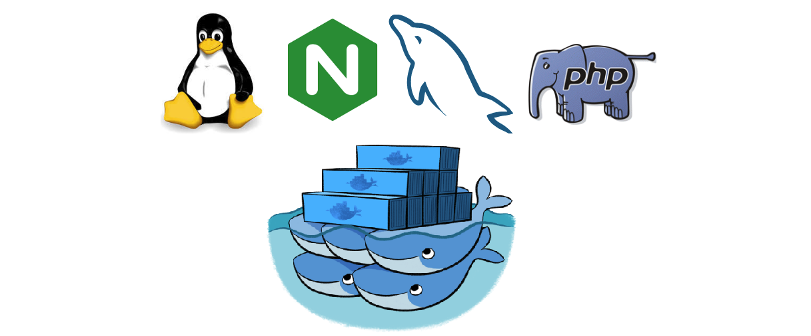
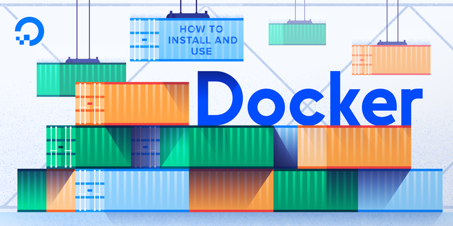

##  使用 docker-compose 部署 LNMP 环境

### :book: 目录

* [Docker简介](#Docker简介)
* [为什么使用Docker](#为什么使用Docker)
* [版本更新](#版本更新)
* [项目结构](#项目结构)
* [版本更新](#版本更新)
* [如何快速使用](#如何快速使用)
    *   [部署环境要求](#部署环境要求)
    *   [快速启动](#快速启动)
    *   [测试访问](#测试访问)
* [Nginx管理](#Nginx管理)
* [MySQL管理](#MySQL管理)
* [Composer管理](#Composer管理)
* [Crontab管理](#Crontab添加定时任务)
* [证书管理](#证书管理)
    * [本地生成HTTPS](#本地生成HTTPS)
    * [通过Docker生成通用HTTPS](#通过Docker生成HTTPS)
* [遇到的问题](#遇到的问题)

### Docker简介

Docker 是一个开源的应用容器引擎，让开发者可以打包他们的应用以及依赖包到一个可移植的容器中，然后发布到任何流行的 Linux 机器上，也可以实现虚拟化。容器是完全使用沙箱机制，相互之间不会有任何接口。

### 为什么使用Docker

- [x] 加速本地的开发和构建流程，容器可以在开发环境构建，然后轻松地提交到测试环境，并最终进入生产环境
- [x] 能够在让独立的服务或应用程序在不同的环境中得到相同的运行结果  
- [x] 创建隔离的环境来进行测试  
- [x] 高性能、超大规划的宿主机部署  
- [x] 从头编译或者扩展现有的OpenShift或Cloud Foundry平台来搭建自己的PaaS环境

### 版本更新

```java
dnmp
├── v1      -- Nginx + PHHP-FPM
├── v2      -- Alpine Nginx + Tinywan/PHP7.2.3 + PHPRedis4.0
├── v3      -- Alpine Nginx + Tinywan/PHP7.2.3 + PHPRedis4.0 + MySQL5.7 + Reids3.2 Private
├── v4      -- Alpine Nginx + Tinywan/PHP7.2.3 + PHPRedis4.0 + MySQL5.7 Official + Reids5.0 Official
├── v5      -- Alpine Nginx + Tinywan/PHP7.2.3 + PHPRedis4.0 + MySQL5.7 Official + Reids5.0 Official + HTTPS
└── v6      -- Alpine Nginx + Tinywan/PHP7.2.3-v1 + PHPRedis4.0 + MySQL5.7 + Reids5.0 + HTTPS + Crontab
```

### 项目结构  

```java
dnmp
└── dnmp
    ├── conf                    -- Nginx 配置目录
    │   ├── conf.d
    │   │   └── www.conf        -- Nginx 扩展配置文件
    │   ├── fastcgi.conf
    │   ├── fastcgi_params
    │   ├── mime.types
    │   └── nginx.conf          -- Nginx 主配置文件
    ├── docker-compose.yml      -- Docker Compose 配置文件
    ├── etc                     -- 公共配置目录
    │   ├── letsencrypt         -- Nginx 证书目录
    │   │   ├── ssl.crt
    │   │   └── ssl.key
    │   ├── php-fpm.conf        -- PHP-FPM 进程服务的配置文件
    │   ├── php-fpm.d
    │   │   └── www.conf        -- PHP-FPM 扩展配置文件
    │   ├── redis
    │   │   └── redis.conf      -- Redis 配置文件
    │   ├── mysql
    │   │   └── data            -- MySQL 数据存储目录
    │   │   └── my.cnf          -- MySQL 配置文件
    │   └── php.ini             -- PHP 运行核心配置文件
    ├── log                     -- Nginx 日志目录
    │   ├── tp5_access.log
    │   ├── tp5_error.log       -- 项目错误日志
    │   ├── access.log
    │   └── error.log           -- Nginx 系统错误日志
    └── www                     -- 项目代码目录
        └── tp5.1               -- 具体项目目录
            ├── application
            └── public
               └──index.php    -- 项目框架入口文件
```

###    环境要求

* 已经安装 [Docker](https://www.digitalocean.com/community/tutorials/how-to-install-and-use-docker-on-ubuntu-16-04)  
* 已经安装 [Docker-compose](https://www.digitalocean.com/community/tutorials/how-to-install-docker-compose-on-ubuntu-18-04)  

###    如何快速使用 
*   拉取项目：`git clone https://github.com/Tinywan/docker-lnmp.git`  
*   进入目录：`cd production` 
*   启动所有容器（守护进程） 

    ```java
    $ docker-compose up -d
    Starting lnmp-redis ... done
    Starting lnmp-mysql ... done
    Starting lnmp-php ... done
    Recreating lnmp-nginx ... done
    ```
    > 或者直接执行`./start.sh`脚本文件一键启动  

* 浏览器访问  
    * PHP 安装信息：`http://127.0.0.1/`  
    * Redis 扩展：`http://127.0.0.1/redis.php`  
    * MySQL 扩展：`http://127.0.0.1/mysql.php`

* 注意连接：
    * Redis 容器内连接，连接主机为：`lnmp-redis`
    * MySQL 容器内连接，连接主机为：`lnmp-mysql`

*   浏览器输入：`https://127.0.0.1:8088/index/index/index`
    * 支持Https `https://docker-v5.frps.tinywan.top/`（测试环境，请手动输入https://）
    * 支持frp反向代理 `http://docker-v1.frp.tinywan.top:8007/`
*   请务必给使用`-v`挂载主机目录赋予权限：`sudo chown -R 1000 data(宿主机目录)`



#### 容器管理  

*   进入Docker 容器  

    * Linux 环境  `$ docker exec -it lnmp-php bash`
    * Windows 环境  `$ winpty docker exec -it lnmp-php bash`

*   单独重启redis服务 `docker-compose up --no-deps -d redis` 
    > 如果用户只想重新部署某个服务，可以使用 `docker-compose up --no-deps -d <SERVICE_NAME>` 来重新创建服务并后台停止旧服务，启动新服务，并不会影响到其所依赖的服务。

*   单独加载配置文件，列如修改了nginx配置文件`www.conf`中的内容，如何即使生效，请使用以下命令重启容器内的Nginx配置文件生效：

    ```java
    docker exec -it lnmp-nginx nginx -s reload
    ```
    > `lnmp-nginx`为容器名称（`NAMES`），也可以指定容器的ID  
    
    > `nginx`为服务名称（`docker-compose.yml`）  

*   修改`docker-compose.yml`文件之后，如何使修改的`docker-compose.yml`生效

    ```java
    docker-compose up --no-deps -d  nginx
    ```
    > 以上表示只是修改了`docker-compose.yml`中关于Nginx相关服务器的配置  

*   容器资源使用情况    
    *   所有运行中的容器资源使用情况：`docker stats`  
    *   查看多个容器资源使用：`docker stats lnmp-nginx lnmp-php lnmp-mysql lnmp-redis`  
    *   自定义格式的docker统计信息：`docker stats --all --format "table {{.Container}}\t{{.CPUPerc}}\t{{.MemUsage}}" lnmp-nginx lnmp-php`  

*   docker-compose常用命令

    *   启动`docker-compose.yml`定义的所有服务：`docker-compose up`
    *   重启`docker-compose.yml`中定义的所有服务：`docker-compose restart`
    *   停止`docker-compose.yml`中定义的所有服务(当前目录配置)：`docker-compose stop`
    *   停止现有 docker-compose 中的容器：`docker-compose down`（重要）
        > 如果你修改了`docker-compose.yml`文件中的内容，请使用该命令，否则配置文件不会生效  
        > 例如：Nginx或者 MySQL配置文件的端口
    *   重新拉取镜像：`docker-compose pull`   
    *   后台启动 docker-compose 中的容器：`docker-compose up -d`   

### Nginx管理  

*   配置文件端口必须和 `docker-compose.yml`的`ports - 8088:80`中的映射出来的端口对应
    > 列如：`conf/conf.d/www.conf`中配置端口为 `8888`,则映射端口也`8888`，对应的映射端口为：`8080:8888`

*   虚拟主机参考配置

    ```java
    server {
        listen 443 ssl http2;
        listen [::]:443 ssl http2;

        server_name docker.tinywan.top;
        set $base /var/www/docker;
        root $base;

        ssl_certificate /etc/letsencrypt/docker.tinywan.top/fullchain.cer;
        ssl_certificate_key /etc/letsencrypt/docker.tinywan.top/docker.tinywan.top.key;

        location / {
            if (!-e $request_filename) {
                rewrite  ^(.*)$  /index.php?s=$1  last;
                break;
            }
        }

        # . files
        location ~ /\.(?!well-known) {
            deny all;
        }

        # assets, media
        location ~* \.(?:css(\.map)?|js(\.map)?|jpe?g|png|gif|ico|cur|mp3|m4a|aac||flv|wmv)$ {
            expires 7d;
            access_log off;
        }

        # svg, fonts
        location ~* \.(?:svgz?|ttf|ttc|otf|eot|woff2?)$ {
            add_header Access-Control-Allow-Origin "*";
            expires 7d;
            access_log off;
        }

        location ~ \.php$ {
            # 404
            try_files $fastcgi_script_name =404;

            # default fastcgi_params
            include        fastcgi_params;

            # fastcgi settings
            fastcgi_pass lnmp-php:9000;
            fastcgi_split_path_info ^(.+\.php)(/.+)$;
            fastcgi_index   index.php;
            fastcgi_buffers 8 16k;
            fastcgi_buffer_size 32k;
            fastcgi_param  SCRIPT_FILENAME  $document_root$fastcgi_script_name;
        }
    }
    ```

### MySQL管理

* 进入容器：`docker exec -it lnmp-mysql /bin/bash`
* 容器内连接：`mysql -uroot -p123456`
* 外部宿主机连接：`mysql -h 127.0.0.1 -P 3308 -uroot -p123456`

### Composer管理

*   需要进入`lnmp-php`容器： `docker exec -it lnmp-php bash`
*   查看 `composer`版本：`composer --version`

    ```java  
    Composer version 1.8.0 2018-12-03 10:31:16
    ```

*   修改 composer 的全局配置文件（推荐方式）
    ```
    composer config -g repo.packagist composer https://packagist.phpcomposer.com
    ```
    > 如果你是墙内客户，务必添加以上国内镜像
    
*   更新框架或者扩展
    ```java
    /var/www/tp5.1# composer update
    - Installing topthink/think-installer (v2.0.0): Downloading (100%)
    - Installing topthink/framework (v5.1.32): Downloading (100%)
    Writing lock file
    Generating autoload files
    ```
### Crontab管理

*   需要进入`lnmp-php`容器： `docker exec -it lnmp-php bash`
*   添加Crontab任务 `crontab -e`  
*   添加任务输出日志到映射目录：`* * * * * echo " Hi Lnmp " >> /var/www/crontab.log`
*   定时执行ThinkPHP5自带命令行命令：`*/30 * * * * /usr/local/php/bin/php /var/www/tp5.1/think jobs hello`

### 证书管理

#### 本地生成HTTPS

生成本地 HTTPS 加密证书的工具 [mkcert](https://github.com/FiloSottile/mkcert),一个命令就可以生成证书，不需要任何配置。

*   本地本地`C:\Windows\System32\drivers\etc\hosts`文件，添加以下内容

    ```
    127.0.0.1	dnmp.com
    127.0.0.1	www.dnmp.org
    127.0.0.1	www.dnmp.cn
    ```

*   一键生成证书。进入证书存放目录：`$ cd etc/letsencrypt/`   

    *   首次运行时，先生成并安装根证书  

        ```
        $ mkcert --install
        Using the local CA at "C:\Users\tinywan\AppData\Local\mkcert" ✨
        ```

    *   自定义证书签名  

        ```
        $ mkcert dnmp.com "*.dnmp.org" "*.dnmp.cn" localhost 127.0.0.1
        Using the local CA at "C:\Users\tinywan\AppData\Local\mkcert" ✨

        Created a new certificate valid for the following names 📜
        - "dnmp.com"
        - "*.dnmp.org"
        - "*.dnmp.cn"
        - "localhost"
        - "127.0.0.1"

        Reminder: X.509 wildcards only go one level deep, so this won't match a.b.dnmp.org ℹ️

        The certificate is at "./dnmp.com+4.pem" and the key at "./dnmp.com+4-key.pem" ✅
        ```

*   已经生成的证书

    ```
    $ ls etc/letsencrypt/
    dnmp.com+4.pem  dnmp.com+4-key.pem
    ```

*   配置Nginx 虚拟主机配置文件

    ```
    server {
        listen 443 ssl http2;
        server_name www.dnmp.cn;

        ssl_certificate /etc/letsencrypt/dnmp.com+4.pem;
        ssl_certificate_key /etc/letsencrypt/dnmp.com+4-key.pem;

        ...
    }
    ```

*   浏览器访问效果  

    

#### 通过Docker生成 HTTPS

```java
$ docker run --rm  -it -v "D:\Git\docker-lnmp\dev\nginx\v5\etc\letsencrypt":/acme.sh \
-e Ali_Key="LTAIn" -e Ali_Secret="zLzA" neilpang/acme.sh --issue --dns dns_ali \
-d tinywan.top -d *.tinywan.top -d *.frps.tinywan.top
```

> 保存目录
* Linux 环境 : `/home/www/openssl`
* Windows 环境 : `D:\Git\docker-lnmp\dev\nginx\v5\etc\letsencrypt`

> 参数详解（阿里云后台获取的密钥）
* `Ali_Key` 阿里云 AccessKey ID
* `Ali_Secret` 阿里云 Access Key Secret

### 多域名配置
*   域名列表
    *   HTTP访问：
        *   1、http://localhost:8081/
        *   2、http://localhost:8082/
    *   HTTPS访问：    
        *   1、https://docker-v5.frps.tinywan.top/
        *   2、https://docker-v6.frps.tinywan.top/
        *   3、https://docker-v7.frps.tinywan.top/
*   配置文件列表

### 遇到的问题

*   连接Redis报错：`Connection refused`，其他客户端可以正常连接
    > 容器之间相互隔绝，在进行了端口映射之后，宿主机可以通过127.0.0.1:6379访问redis，但php容器不行。在php中可以直接使用`hostname: lnmp-mysql-v3` 来连接redis容器。[原贴地址](https://stackoverflow.com/questions/42360356/docker-redis-connection-refused/42361204)

*   Windows 10 启动错误 `Error starting userland proxy: Bind for 127.0.0.1:3306: unexpected error Permission denied `  
    > 检查本地是否有MySQL已经启动或者端口被占用。关闭即可 

*   Linux 环境启动的时候，MySQL总是`Restarting`：`lnmp-mysql-v6    docker-entrypoint.sh --def ...   Restarting`
    > 解决办法：`cd etc/mysql `，查看文件权限。最暴力的：`rm -r data && mkdir data`解决问题
*   ThinkPHP5，`thinkphp5 404 file_put_contents` 无法权限被拒绝
    > 执行命令：`chmod -R 777 runtime`
    > 如果图片上传也有问题：`chmod -R 777 upload`
    
###  参考

*   [Dockerise your PHP application with Nginx and PHP7-FPM](http://geekyplatypus.com/dockerise-your-php-application-with-nginx-and-php7-fpm/)
*   [docker-openresty](https://github.com/openresty/docker-openresty)

*   相比`nginx:latest`，`nginx:alpine`有几点优势：
    * 用的是最新版nginx镜像，功能与`nginx:latest`一模一样
    * alpine 镜像用的是[Alpine Linux](https://alpinelinux.org/)内核，比ubuntu内核要小很多。
    * `nginx:alpine` 默认支持http2。
*   [Docker Volume 之权限管理(转)](https://www.cnblogs.com/jackluo/p/5783116.html)
